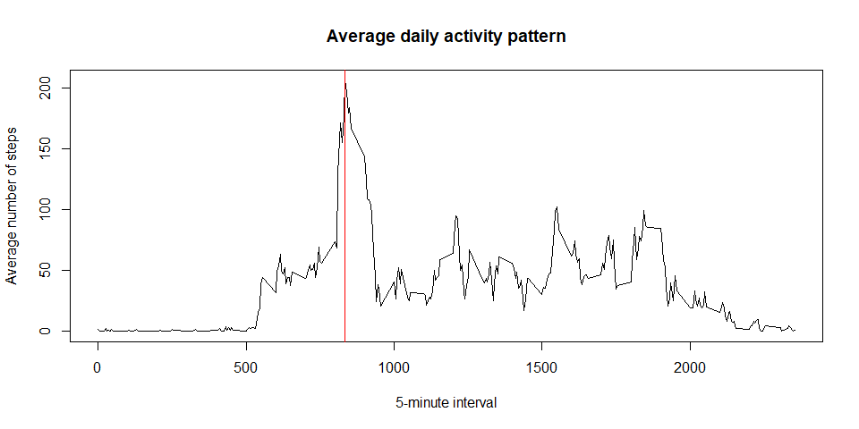

## Loading R library

```r
library("dplyr")
```

```
## 
## Attaching package: 'dplyr'
```

```
## The following objects are masked from 'package:stats':
## 
##     filter, lag
```

```
## The following objects are masked from 'package:base':
## 
##     intersect, setdiff, setequal, union
```

```r
library("ggplot2")
library("Hmisc")
```

```
## Loading required package: lattice
```

```
## Loading required package: survival
```

```
## Loading required package: Formula
```

```
## 
## Attaching package: 'Hmisc'
```

```
## The following objects are masked from 'package:dplyr':
## 
##     src, summarize
```

```
## The following objects are masked from 'package:base':
## 
##     format.pval, units
```

## Loading and preprocessing the data

```r
tPath <- "D:/00-PDrive/MyStudy/01-Course/00-Coursera/2-DSFusingR/5-Reproducible/Project1"
setwd(tPath)
master <- as.character(unzip("repdata_data_activity.zip", list = TRUE)$Name)
Dat <- read.csv(unz("repdata_data_activity.zip", "activity.csv"), header = TRUE, sep = ",") 
dim(Dat)
```

```
## [1] 17568     3
```

```r
head(Dat)
```

```
##   steps       date interval
## 1    NA 2012-10-01        0
## 2    NA 2012-10-01        5
## 3    NA 2012-10-01       10
## 4    NA 2012-10-01       15
## 5    NA 2012-10-01       20
## 6    NA 2012-10-01       25
```

```r
Dat$date <- as.Date(Dat$date, "%Y-%m-%d")
str(Dat)
```

```
## 'data.frame':	17568 obs. of  3 variables:
##  $ steps   : int  NA NA NA NA NA NA NA NA NA NA ...
##  $ date    : Date, format: "2012-10-01" "2012-10-01" ...
##  $ interval: int  0 5 10 15 20 25 30 35 40 45 ...
```
## What is mean total number of steps taken per day?

- Aggregation total steps according to day

```r
totSteps <- Dat %>%
    group_by(date) %>%
    summarise_at(vars(steps), list(totSteps = sum), na.rm = TRUE)
totStepsbyDay <- as.data.frame(totSteps)
head(totStepsbyDay)
```

```
##         date totSteps
## 1 2012-10-01        0
## 2 2012-10-02      126
## 3 2012-10-03    11352
## 4 2012-10-04    12116
## 5 2012-10-05    13294
## 6 2012-10-06    15420
```
- Draw a graph to show the total number of steps for each day

```r
g <- ggplot(data = totStepsbyDay, aes(x= date, y = totSteps))
g <- g + geom_bar(stat = "identity", color="blue", fill="steelblue")
g + ylab("Total Steps") + xlab("") 
```

<!-- -->

- Histogram of the total number of steps taken each day

```r
hist(totStepsbyDay$totSteps, xlab = "Total Steps per Dat", main = "Histogram of the total number of steps taken each day")
```

<!-- -->

- Mean and median of the total number of steps taken per day:  9354 and 10395


```r
summary(totStepsbyDay$totSteps)
```

```
##    Min. 1st Qu.  Median    Mean 3rd Qu.    Max. 
##       0    6778   10395    9354   12811   21194
```

## What is the average daily activity pattern?

- The time series plot of the average number of steps taken


```r
mSteps <- Dat %>%
    group_by(interval) %>%
    summarise_at(vars(steps), list(meanSteps = sum), na.rm = TRUE)
meanSteps <- as.data.frame(mSteps)
head(meanSteps)
```

```
##   interval meanSteps
## 1        0        91
## 2        5        18
## 3       10         7
## 4       15         8
## 5       20         4
## 6       25       111
```

```r
maxPos <- which.max(meanSteps$meanSteps)
maxIntv <- meanSteps[maxPos, 1]
with(meanSteps, plot(x = interval, y = meanSteps, type = "l", 
    xlab = "5-minute interval", ylab = "Average number of steps", 
    main = "Average daily activity pattern"))
abline(v = maxIntv, col = "red")
```

<!-- -->

- The maximum 5-minute interval is at 835 and the value is 10927. 

## Imputing missing values

- impute steps with mean value using r "Hmisc" package


```r
Dat$imputedSteps <- with(Dat, impute(steps, mean))
head(Dat)
```

```
##   steps       date interval imputedSteps
## 1    NA 2012-10-01        0      37.3826
## 2    NA 2012-10-01        5      37.3826
## 3    NA 2012-10-01       10      37.3826
## 4    NA 2012-10-01       15      37.3826
## 5    NA 2012-10-01       20      37.3826
## 6    NA 2012-10-01       25      37.3826
```

- Aggregation total steps according to day using imputed data


```r
totSteps_I <- Dat %>%
    group_by(date) %>%
    summarise_at(vars(imputedSteps), list(totSteps = sum), na.rm = TRUE)
totStepsbyDay_I <- as.data.frame(totSteps_I)
head(totStepsbyDay_I)
```

```
##         date totSteps
## 1 2012-10-01 10766.19
## 2 2012-10-02   126.00
## 3 2012-10-03 11352.00
## 4 2012-10-04 12116.00
## 5 2012-10-05 13294.00
## 6 2012-10-06 15420.00
```

- Histogram of the total number of steps taken each day using imputed data


```r
hist(totStepsbyDay_I$totSteps, xlab = "Total Steps per Dat", 
     main = "Histogram of the total number of steps taken each day using imputed data")
```

<!-- -->


## Are there differences in activity patterns between weekdays and weekends?


